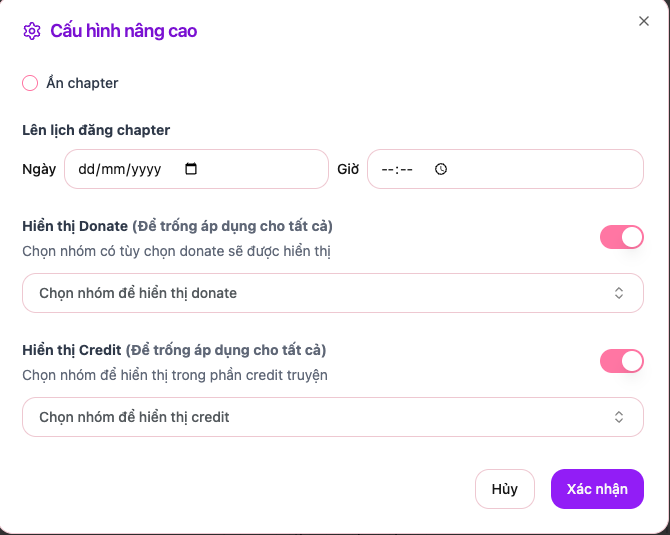

# Cấu hình Truyện và Chapter

## Tổng quan

Tính năng **Cấu hình Truyện và Chapter** cho phép các nhóm dịch thuật, có thể cấu hình hiển QR và Credit của nhóm ở mỗi truyện và chapter của nhóm

## Cấu hình truyện

Tại giao diện edit truyện sẽ có thêm thêm nút cấu hình, nhấn vào đó sẽ hiển thị ra model dùng để cấu hình truyện.
Tại giao diện này bạn có thể cấu hình:

- **Nhóm collab**: Chọn nhóm collab để cùng làm chung bộ truyện
- **Hiển thị donate**: Có thể tùy chọn hiển thị donate của nhóm tại truyện này.
- **Hiển thi credit**: Tùy chọn hiển thị credit của nhóm tại mỗi chapter

## Cấu hình chapter

Tại dây bạn có thể tùy chỉnh cấu hình chapter của nhóm:

- **Ẩn chapter**: Ẩn chapter với độc giả.
- **Lên lịch đăng truyện**: Có thể tùy chỉnh thời gian chapter có tự động đăng lên
- **Hiển thị donate**: Chọn nhóm để hiển thị donate (Để trống sẽ tự động áp dụng cho tất cả các nhóm của truyện)
- **Hiển thị credit**: Chọn nhóm để hiển thị credit (Để trống sẽ tự động áp dụng cho tất cả các nhóm của truyện)

