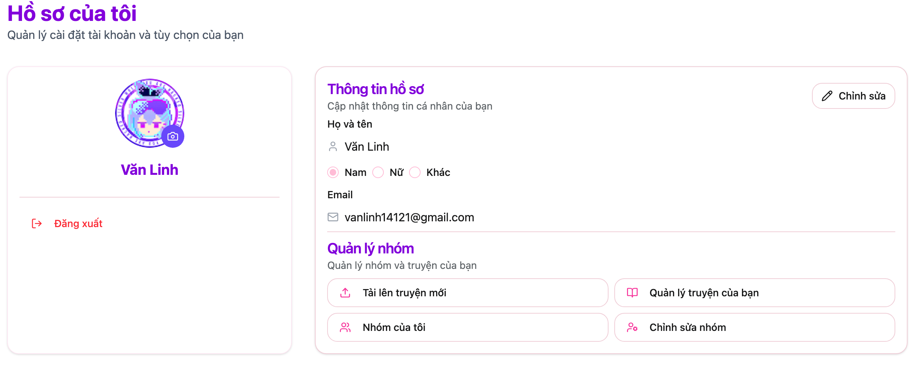
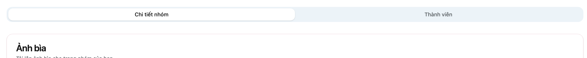
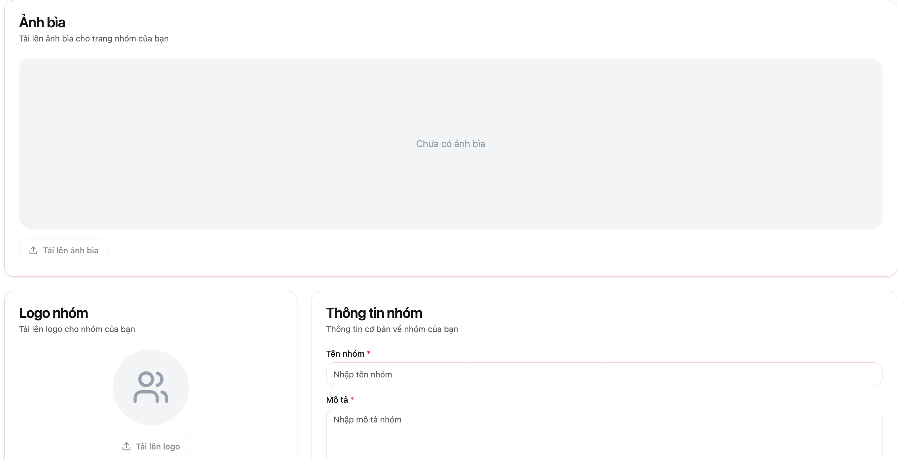
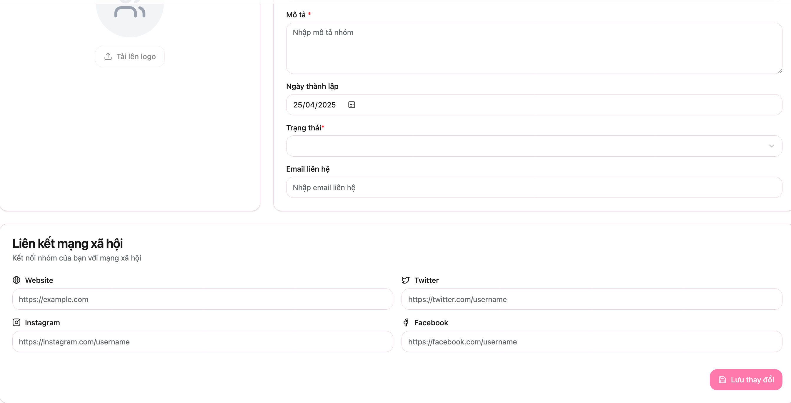
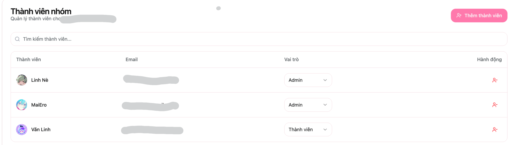

# Chỉnh sửa thông tin

Giao diện hồ sơ người dùng hiển thị thông tin cá nhân và các tùy chọn quản lý nhóm.

## Truy cập nhóm
Khi các nhóm được cấp quyền thì xong hồ sơ của nhóm sẽ có thêm mục `Quản lý nhóm`. Các thông tin bao gồm:
- `Quản lý truyện của bạn`: Nơi hiển thị và quản lý tất cả các truyện của nhóm đã đăng.
- `Tải lên truyện mới`: Nơi các nhóm có thể upload truyện mới.
- `Nhóm của tôi`: Sẽ chuyển qua giao diện thông tin nhóm.
- `Chỉnh sửa nhóm`: Nơi mà các nhóm có thể thay đổi thông tin về nhóm như: Avatar, banner, tên, thành viên,..... (Lưu ý chỉ có `Admin` của nhóm mới có thể thấy giao diện này)

## Chỉnh sửa thông tin nhóm
Khi nhấn vào `Chỉnh sửa nhóm`. Giao diện sẽ chuyển qua nơi chính sửa thông tin. Bao gồm 2 mục:

### Chi tiết nhóm
- Điều chỉnh các thông tin cơ bản bao gồm:
    + **Thông tin cơ bản**: Tên, logo, mô tả, trạng thái,...
    + **Liên kết mạng xã hội**: Các liên kết bên ngoài của nhóm

### Thành viên nhóm
- Thêm/Điều chỉnh thành viên và các quyền của thành viên

