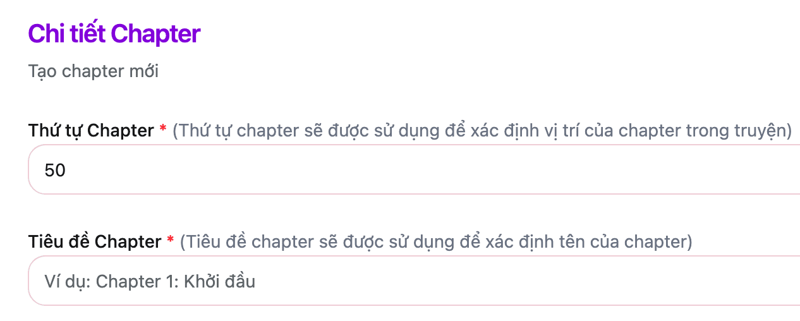
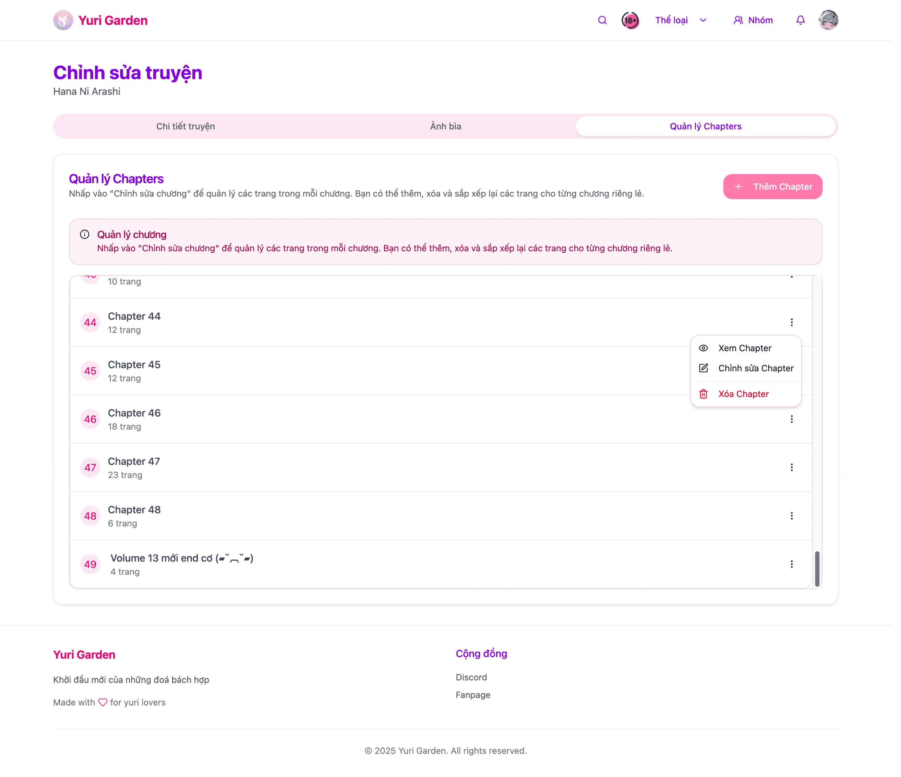

# Chapters

## Cách truy cập vào giao diện
- Tại giao diện `Thông tin truyện` sẽ xuất hiện thêm nút `Upload` nhấn vào nút này để tới giao diễn `Quản lý chapters`
- Ở giao diện `Hồ sơ` tại phần Quản lý nhóm nhấn vào `Quản lý truyện của bạn` => Chọn truyện và nhấn vào `Chỉnh sửa chương và trang` sau đó chọn tab `Quản lý chapters`

## Chapter

### Tổng quan giao diện

- Ở giao diện này sẽ hiện thị tất cả các chapter của truyện.
- Để chỉnh sửa/thêm mới vui lòng nhấn vào button tương ứng

### Lưu ý quan trọng

- **Kích thước tối đa của mỗi ảnh không được quá 7MB**
- `Thứ tự Chapter`: Đây chỉ là thứ tự dùng để sắp xếp thứ tự của các chapter. Nếu các bạn đăng truyện theo thứ tự thì có thể bỏ qua phần này nó sẽ tự động tăng lên mỗi khi bạn thêm chapter mới
- `Tiêu đề chapter`: Đây sẽ là tên sẽ hiển thị ra bên ngoài truyện của bạn. Ví dụ:
    + Nếu bạn đặt là: `Chapter 1: ABC` thì khi người dùng vào truyện nó sẽ hiện thì là `Chapter 1: ABC`
    + Nếu bạn đặt là: `ABC` thì khi người dùng vào truyện sẽ hiển thị là `ABC`

### Cập nhật/thêm mới chapter

- Để thêm mới chapter nhấn vào nút 
- Để chỉnh sửa chapter vui lòng chọn chapter tương ứng và nhấn vào `Chỉnh sửa Chapter` 

