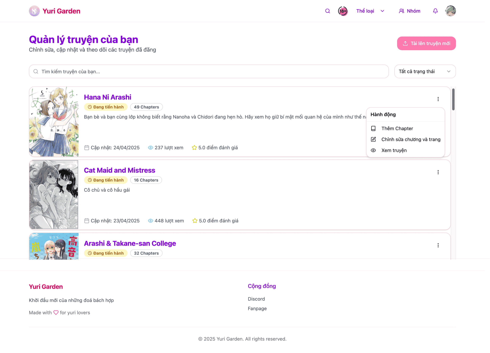
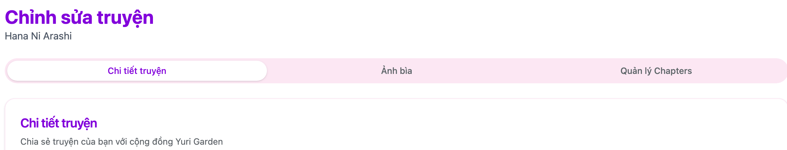

# Quản lý truyện của nhóm

## Cách truy cập vào giao diện quản lý

- Ở giao diện `Hồ sơ` tại phần Quản lý nhóm nhấn vào `Quản lý truyện của bạn`
- Nhấn vào nút `Upload` ở menu khi nhấn vào icon avatar

## Chỉnh sửa thông tin truyện

### Tổng quan giao diện

- Ở giao diện này sẽ hiện thị tất cả các truyện của nhóm.
- Để chỉnh sửa thông tin truyện nhấn vào dấu 3 chấm ở cuối truyện và chọn `Chỉnh sửa chương và trang`

### Cập nhật thông tin truyện

Ở giao diện `Chỉnh sửa truyện` sẽ có 3 phần chính

- `Chi tiết truyện`: Chỉnh sửa thông tin cơ bản của truyện.
- `Ảnh bìa`: Cập nhật ảnh bìa của truyện
- `Quản lý chapter`: Quản lý tất cả chapter của truyện. Chi tiết xem tại [Quản lý chapter](manage_chapter)

