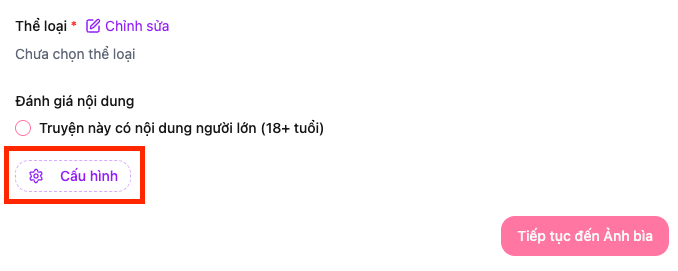
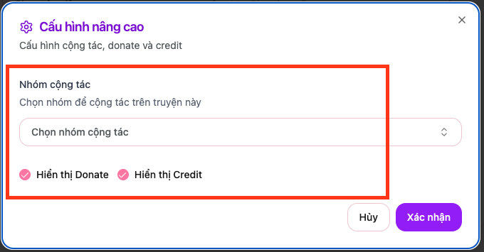

# Collab nhóm

Mục đích là có thể hợp tác giữa các nhóm để tạo ra những tác phẩm chất lượng cao và tăng hiệu quả làm việc.

## Tổng quan

Tính năng **Collab nhóm** cho phép các nhóm dịch thuật khác nhau hợp tác với nhau trong việc dịch truyện. Điều này giúp tối ưu hóa nguồn lực và tận dụng thế mạnh của từng nhóm.

## Cấu hình collab

Tại giao diện edit truyện sẽ có thêm thêm nút cấu hình, nhấn vào đó sẽ hiển thị ra model dùng để cấu hình truyện. Trong đó sẽ có mục collab nhóm

Khi nhấn vào sẽ hiển thị ra modal cấu hình của truyện, trong đó sẽ có mục team collab

Tại đây bạn có thể chọn nhóm mà bạn collab để cùng làm chung bộ truyện.

### Lưu ý

- Tính năng collab chỉ có thể thêm hoặc edit bởi nhóm đăng bộ truyện đó
- Nhóm collab sẽ có toàn quyền chỉnh và edit các chapter của truyện
