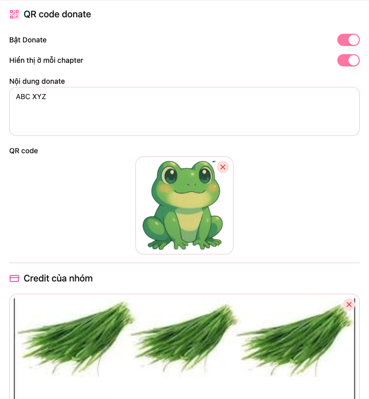
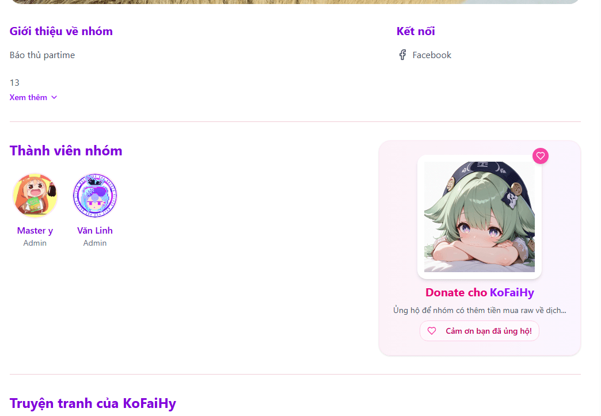
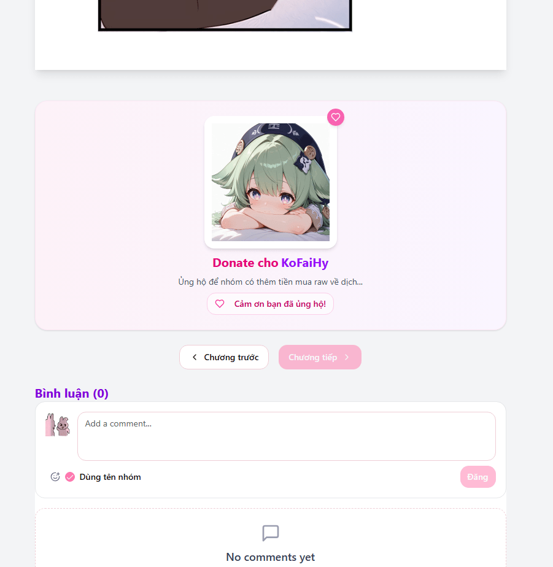

# Cấu hình của nhóm

## Lưu ý quan trọng:

- Hiện tại trên web có một vài nhóm đang reup truyện của nhóm khác. Vì vậy **để tôn trọng công sức của nhóm dịch gốc**, Nhóm reup truyện **không được** bật **QR donate ở truyện đó**. Chi tiết cấu hình tại: [Cấu hình Truyện và Chapter](comic_config#cấu-hình-chapter)

Ở giao diện chỉnh sửa nhóm sẽ có thêm mục `Cấu hình`

## Cách cấu hình donate

- **Bật Donate**: Khi bật sẽ hiển thị doante ở giao diện nhóm
- **Hiển thị ở mỗi chapter**: Khi được bật donate sẽ được hiển thị ở cuối mỗi chapter truyện của nhóm
- **Nội dung donate**: Là nội dung sẽ hiển thị kèm theo trên mỗi QR
- **QR code**: QR chuyển khoảng ngân hàng

## Cấu hình credit

- Nhóm có thể cấu hình credit để có thể tự động thêm vào ở cuối mỗi chapter.
- Nhóm có thể tùy chọn chapter hay truyện bất kì để hiển thị credit và donate. Chi tiết xem tại: [Cấu hình Truyện và Chapter](comic_config)

**Cấu hình của nhóm**

**Donate hiển thị ở nhóm**

**Donate sẽ hiển thị ở mỗi chapter**

