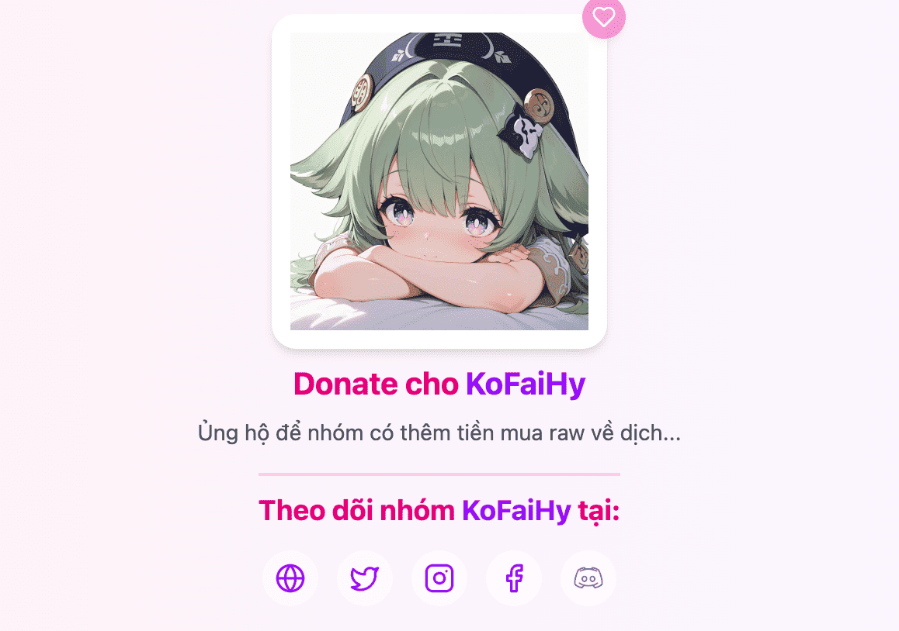

# Liên kết ngoài của nhóm

Mục đích để nhóm có thể thêm các liên kết bên ngoài của nhóm như: Facebook, Discord, Twiter,... Cho các đọc giả có thể theo dõi nhóm trên các nền tảng và tăng tương tác.

## Chỉnh sửa liên kết
Tại giao diện chỉnh sửa nhóm các bạn có thể thêm các liên kết ngoài ở mục **Liên kết mạng xã hội**

## Hiển thị liên kết
- Khi bạn thêm **Liên kết mạng xã hội** mặc định ở mỗi chapter truyện của bạn sẽ hiển thị các đường liên kết mà bạn đã thêm.

