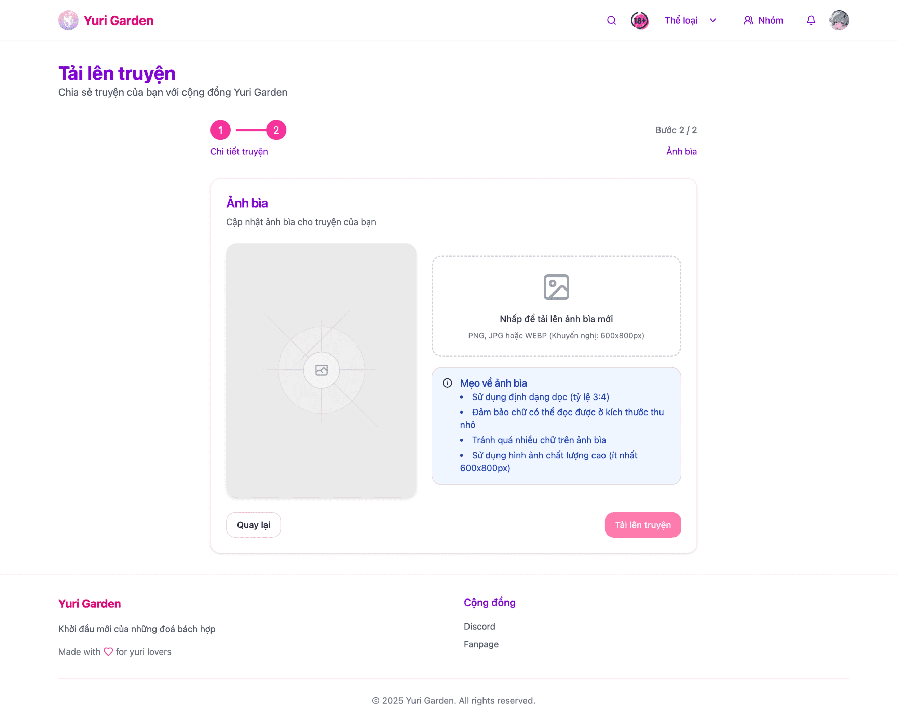

# Upload truyện

## Upload truyện mới

Các nơi để upload truyện mới.

- `Hồ sơ` => Ở mục `Quản lý nhóm` nhấn vào `Tải lên truyện mới`
- `Tải lên` / `Quản lý truyện của bản` => `Tải lên truyện mới`

### Thông tin truyện

Ở giao diện này các bạn vui lòng điền các thông tin cơ bản của truyện sau đó nhấn `Tiếp tục đến ảnh bìa` để có thể upload ảnh bìa của truyện.

#### Lưu ý:

    - Nhóm có thể nhấn vào button **Tìm kiếm** ở góc để có thể tra cứu các truyện đã có trên web để tránh đăng trùng với các nhóm khác
    - Button "Cấu Hình" giúp nhóm có thể cấu hình hiển thị **donate** và **credit**. Chi tiết tại: [Cấu hình Truyện và Chapter](comic_config)
    - Vui lòng kiểm tra kĩ thông tin của truyện, bao gốm các tag liên quan.
    - Khi thêm tác giả, vui lòng kiểm tra danh sách tác giả đã có trên web, nếu không có thì mới tạo mới
    - Nếu truyện có nội dung 18+ vui lòng check `Truyện này có nội dung người lớn (18+ tuổi)`

### Ảnh bìa truyện

Ở giao diện này các bạn có thể upload ảnh bìa của truyện:

#### Lưu ý:

    - Ảnh bìa trên web sẽ hiển thị dưới tỷ lệ 3:4
    - Dung lượng ảnh không được quá lớn (tối đa 7MB)

Khi hoàn thành các bước này bạn hãy nhấn `Tải lên truyện` hệ thống sẽ upload truyện của bạn lên web
