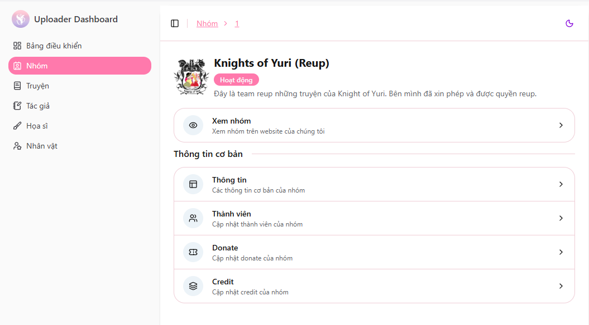
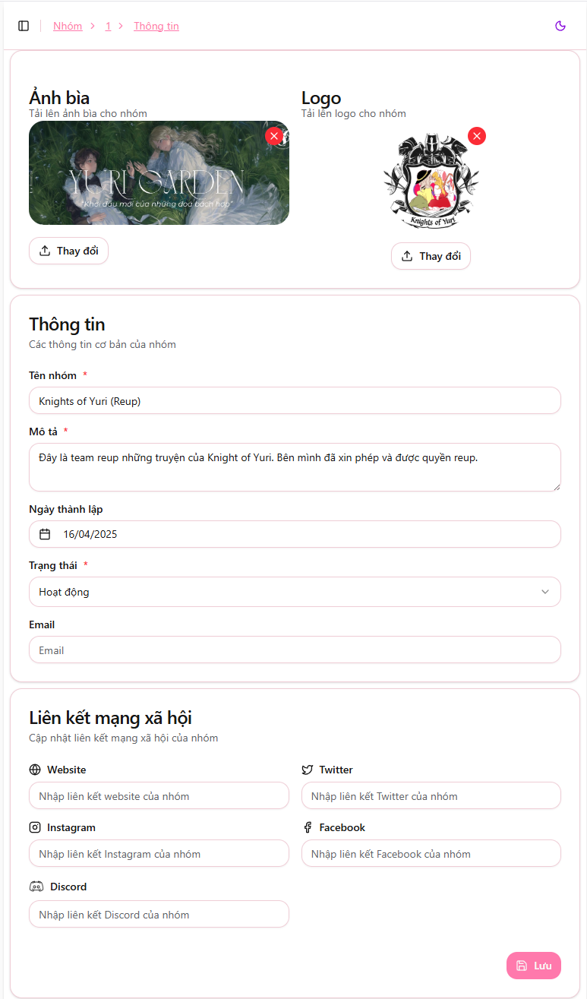
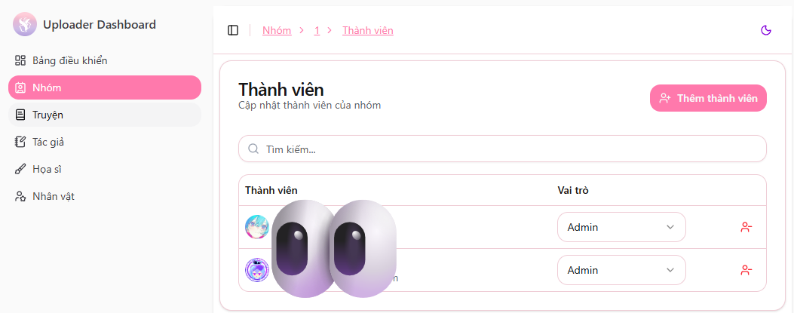

# Chỉnh sửa thông tin nhóm

Sau khi được cấp quyền upload, bạn có thể quản lý thông tin nhóm của mình thông qua trang Upload.

Tại giao diện web upload, chọn mục **"Nhóm"** để truy cập **Team Dashboard**, nơi bạn có thể xem và chỉnh sửa mọi thông tin liên quan đến nhóm.

---

## Cập nhật thông tin nhóm

Chọn mục **"Thông tin"** trên Team Dashboard để mở giao diện chỉnh sửa thông tin nhóm.

Bạn có thể cập nhật các mục sau:

| Thông tin | Mô tả |
|---|---|
| **Ảnh bìa** | Ảnh nền (cover) hiển thị trên trang nhóm |
| **Logo** | Logo đại diện của nhóm |
| **Tên nhóm** | Tên hiển thị của nhóm dịch |
| **Mô tả** | Giới thiệu ngắn gọn về nhóm |
| **Ngày thành lập** | Thời gian thành lập nhóm |
| **Email** | Email liên hệ |
| **Liên kết mạng xã hội** | Link đến Facebook, Discord, Website,... của nhóm |

Nhấn **Lưu** để cập nhật thông tin sau khi chỉnh sửa.

---

## Quản lý thành viên nhóm

Chọn mục **"Thành viên"** trên dashboard để quản lý quyền của các thành viên trong nhóm.

Có hai loại quyền chính:

| Quyền | Mô tả |
|---|---|
| **Admin** | Có thể chỉnh sửa thông tin nhóm & upload truyện |
| **Member** | Chỉ có quyền upload truyện |

> 💡 **Lưu ý:**  
> Quyền thành viên giúp quản lý nhóm hiệu quả, đặc biệt khi nhóm có nhiều uploader khác nhau.

---

✅ Sau khi cập nhật xong, mọi thay đổi sẽ áp dụng ngay lập tức trên hệ thống.

Nếu bạn muốn thêm/xóa thành viên nhưng không thực hiện được, hãy liên hệ admin để được hỗ trợ.
