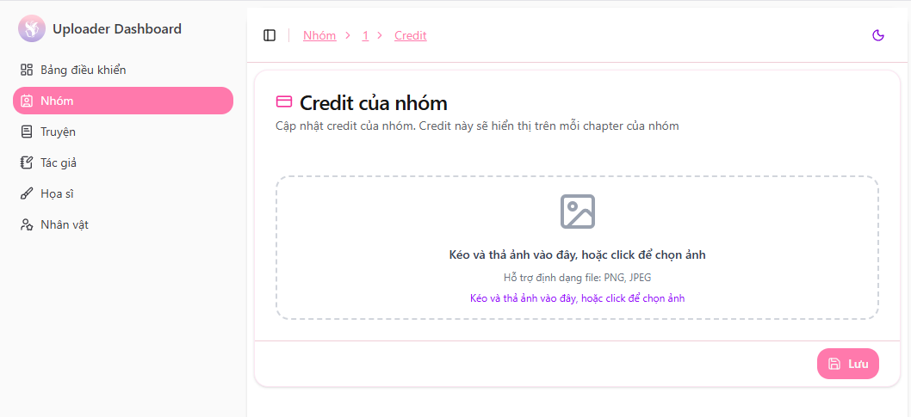

# Credit của nhóm

Yuri Garden hỗ trợ các nhóm dịch hiển thị **credit riêng của nhóm** trên mỗi chapter được đăng tải.  
Credit giúp ghi nhận công sức của nhóm và đảm bảo bản dịch được nhận diện đúng nguồn.

---

## Cấu hình Credit

Để thiết lập credit cho nhóm:

1. Truy cập **Dashboard nhóm**
2. Nhấn vào nút **"Credit"**
3. Upload hình credit hoặc cấu hình nội dung credit của nhóm

Hệ thống sẽ tự động chèn credit của nhóm vào các chapter mà nhóm đăng.

> 📌 **Tip:** Hãy chuẩn bị credit với kích thước phù hợp để hình hiển thị đẹp trên web.

---

## Tùy chỉnh hiển thị credit theo chapter

Bạn có thể tùy chọn bật/tắt hiển thị credit cho từng chapter:

- Vào giao diện chỉnh sửa **Chapter**
- Mở **Cấu hình nâng cao**
- Bật/tắt tùy chọn **"Hiển thị nhóm credit"**

Điều này giúp bạn linh hoạt hơn, đặc biệt khi có chap collab hoặc chap đặc biệt.

---

🎯 Với Credit, nhóm dịch được ghi nhận rõ ràng và chuyên nghiệp trong mỗi bản dịch — hãy cấu hình tín hiệu thương hiệu của nhóm thật đẹp nhé!
