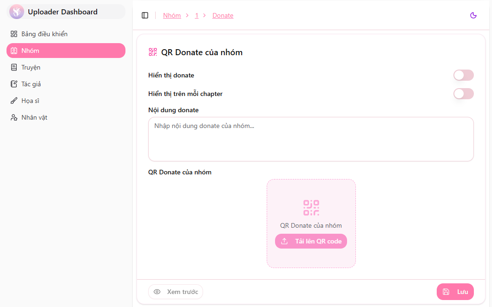

# Donate của nhóm

Website hỗ trợ các nhóm dịch cấu hình thông tin **Donate / Ủng hộ nhóm**.  
Khi bật tính năng này, thông tin donate sẽ được hiển thị trong chapter do nhóm đăng, giúp độc giả dễ dàng ủng hộ nhóm dịch.

---

## Cấu hình Donate

Để thiết lập thông tin donate:

1. Truy cập **Dashboard của nhóm**
2. Nhấn vào nút **"Donate"**
3. Nhập các thông tin donate của nhóm (momo, banking,...)

Sau khi lưu, hệ thống sẽ tự động hiển thị thông tin donate trên các chapter của nhóm.

---

## Tùy chỉnh hiển thị donate theo từng chapter

Nếu bạn muốn bật/tắt donate cho một chapter cụ thể:

- Vào trang chỉnh sửa chapter
- Mở **Cấu hình nâng cao**
- Bật/tắt mục **"Hiển thị donate"**

Điều này giúp nhóm linh hoạt khi có những chapter cần ẩn donate (ví dụ: chapter collab).

---

🎯 Hãy cập nhật thông tin donate rõ ràng, súc tích để độc giả có thể ủng hộ nhóm dễ dàng nhé!
