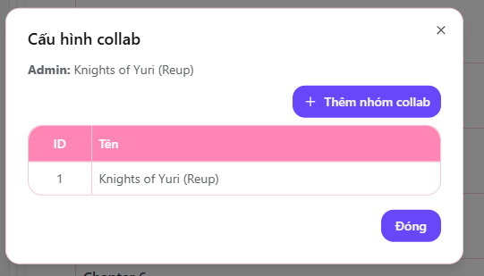

# Collab nhóm

Tính năng **Collab nhóm** cho phép nhiều nhóm dịch cùng tham gia thực hiện một bộ truyện.  
Mục tiêu của tính năng này là giúp các nhóm có thể hợp tác, chia sẻ nguồn lực và tạo ra bản dịch chất lượng hơn.

---

## Thiết lập Collab

Tại giao diện quản lý chapter, bạn sẽ thấy nút **"Thêm nhóm collab"**.  
Nhấn vào nút này để mở danh sách và chọn nhóm mà bạn muốn mời cùng tham gia thực hiện bộ truyện.

> 📌 Khi nhóm collab được thêm, cả hai nhóm đều có thể tham gia dịch và cập nhật chapter của các nhóm collab.

---

## Lưu ý khi sử dụng Collab

- Chỉ nhóm **chính sở hữu quyền upload của truyện** mới có thể thêm hoặc chỉnh sửa danh sách nhóm collab.
- Nhóm được collab sẽ có **toàn quyền chỉnh sửa chapter**, bao gồm upload, chỉnh sửa và quản lý nội dung liên quan đến chapter của truyện.

> ✅ Hãy đảm bảo thỏa thuận rõ ràng giữa các nhóm trước khi bật collab để tránh mâu thuẫn trong quá trình làm việc.

---

---

🎯 Sử dụng tính năng Collab giúp kết nối cộng đồng dịch thuật, nâng cao chất lượng truyện và đẩy nhanh tiến độ ra chap.
