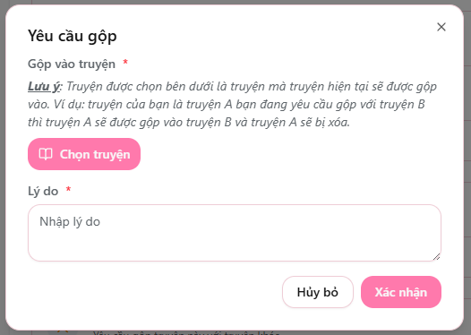
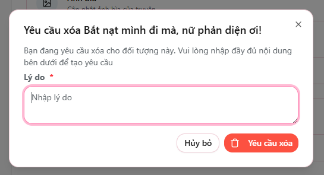

# Các yêu cầu với truyện

Tại **Dashboard** của truyện, bạn có thể thực hiện một số yêu cầu quản lý đặc biệt.  
Các yêu cầu này sẽ được gửi đến Admin để xem xét và xử lý.

---

## Yêu cầu gộp truyện

Sử dụng khi truyện của bạn **bị trùng** với một truyện đã có trên web và cần hợp nhất nội dung.

**Cách thực hiện:**

1. Nhấn **"Yêu cầu gộp"**
2. Chọn **truyện cần gộp vào**
3. Nhập **lý do**
4. Nhấn **Xác nhận**

Admin sẽ xem xét yêu cầu và thực hiện việc gộp nếu phù hợp.

> ⚠️ **Lưu ý quan trọng**  
> - Truyện hiện tại của bạn sẽ được gộp vào truyện được chọn  
> - Sau khi gộp thành công, **truyện của bạn sẽ bị xóa** khỏi hệ thống  

📌 Ví dụ:  
Bạn gửi yêu cầu gộp *Truyện A* vào *Truyện B* → *Truyện A sẽ bị xóa*, nội dung được nhập vào *Truyện B*.

---

## Yêu cầu xóa truyện

Dùng khi truyện được tạo nhầm hoặc cần xóa vì lý do chính đáng.

**Cách thực hiện:**

1. Nhấn **"Yêu cầu xóa"**
2. Nhập **lý do muốn xóa**
3. Nhấn **Xác nhận**

Hệ thống sẽ gửi yêu cầu tới Admin để kiểm tra và tiến hành xóa truyện nếu hợp lệ.

> 💡 Bạn không thể tự xóa truyện — yêu cầu sẽ được admin xử lý để đảm bảo an toàn dữ liệu.

---

🎯 *Hãy kiểm tra thật kỹ trước khi gửi yêu cầu để tránh mất dữ liệu không cần thiết.*
