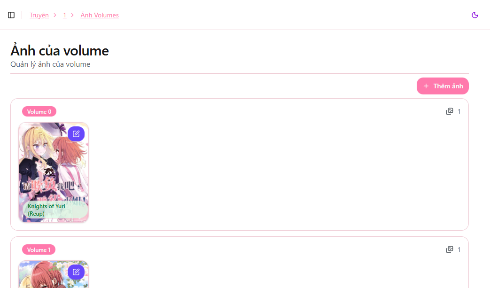
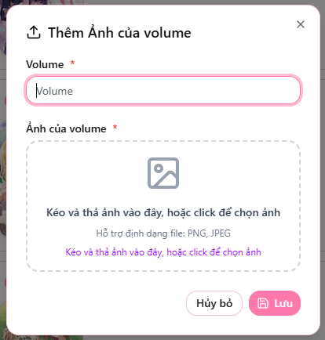

# Quản lý ảnh Volume của truyện

Bạn có thể thêm hoặc chỉnh sửa ảnh Volume cho bộ truyện để hiển thị lên web

Tại **Dashboard** của truyện, chọn mục **"Volumes"** để truy cập giao diện quản lý ảnh Volume.

---

## Thêm hoặc chỉnh sửa Volume

### ➕ Thêm ảnh Volume
Nhấn **"Thêm ảnh"** để tạo Volume mới và tải ảnh tương ứng.

### ✏️ Chỉnh sửa Volume
Nhấn vào biểu tượng chỉnh sửa trên ảnh Volume để cập nhật thông tin hoặc thay ảnh khác.

---

### Thông tin cần nhập

| Trường | Mô tả |
|---|---|
| **Volume** | Tên hoặc số Volume của truyện |
| **Ảnh Volume** | Kéo & thả hoặc chọn ảnh từ máy để tải lên |

> 📌 Lưu ý:  
> - Ảnh Volume giúp người đọc dễ nhận diện từng phần của truyện
> - Hãy chọn ảnh rõ nét và đồng bộ phong cách với ảnh bìa truyện  

Sau khi hoàn tất, nhấn **"Lưu"** để hệ thống cập nhật Volume.

---

🎉 Vậy là bạn đã quản lý xong ảnh Volume cho truyện.  
