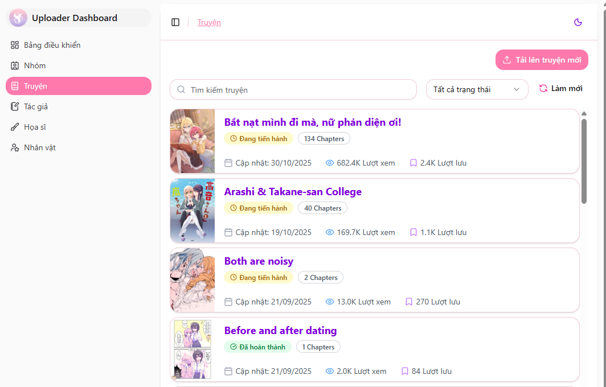

# Quản lý truyện của nhóm

Trang Upload cho phép nhóm dịch quản lý toàn bộ các bộ truyện mà nhóm đã thêm hoặc đang đảm nhận.  
Tại đây, bạn có thể chỉnh sửa thông tin truyện, cập nhật chương, và xử lý các yêu cầu liên quan đến truyện.

---

## Danh sách truyện của nhóm

Đi tới mục **Truyện** trên trang upload để xem tất cả các bộ truyện mà nhóm bạn đang quản lý.

---

## Chỉnh sửa thông tin truyện

Trong danh sách truyện, chọn bộ truyện bạn muốn quản lý.  
Hệ thống sẽ đưa bạn đến trang **Dashboard** của truyện.

Tại đây, bạn có thể thực hiện các thao tác sau:

| Tính năng | Chức năng |
|---|---|
| **Thông tin truyện** | Cập nhật tiêu đề, mô tả, thể loại, tác giả,... |
| **Ảnh bìa** | Thay đổi ảnh bìa chính của truyện |
| **Volumes** | Tạo hoặc chỉnh sửa ảnh của volume (nếu có) |
| **Chapters** | Thêm chương mới, sửa hoặc xóa chương đã đăng |
| **Yêu cầu gộp truyện** | Gửi yêu cầu gộp truyện nếu cần hợp nhất với bản đang có |
| **Yêu cầu xóa truyện** | Gửi yêu cầu xóa truyện trong trường hợp đặc biệt |

---

### Lưu ý quan trọng

- Hãy đảm bảo thông tin truyện chính xác trước khi đăng để tránh nhầm lẫn hoặc trùng nội dung.
- Nếu truyện thuộc sở hữu của nhiều nhóm dịch, vui lòng tôn trọng nhóm đầu tiên đăng tải.
- Khi chỉnh sửa dữ liệu quan trọng (như gộp hoặc xóa truyện), hệ thống sẽ yêu cầu xác nhận và xử lý qua admin.

---

✅ Sau khi chỉnh sửa xong, thay đổi sẽ được lưu theo dữ liệu hiển thị trên web upload. Nếu web chính chưa cập nhật thi có thể là do cache của web đang vẫn còn giữ lại dữ liệu cũ

Nếu bạn gặp lỗi hoặc không thể thao tác, vui lòng liên hệ admin để được hỗ trợ.
