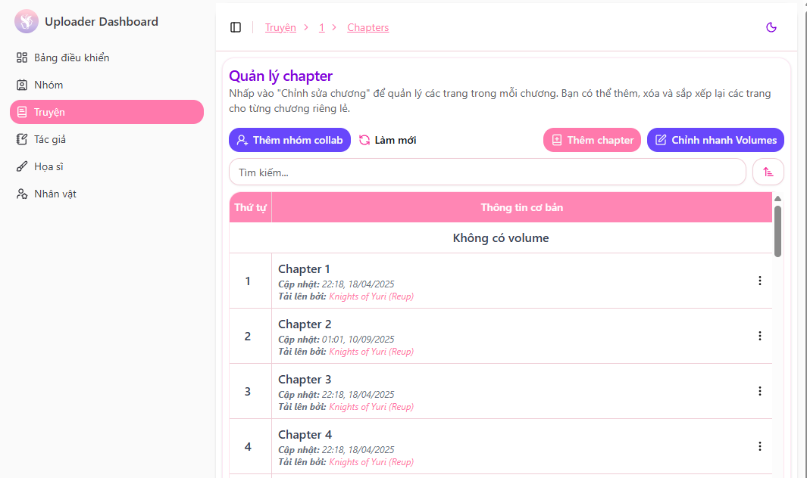
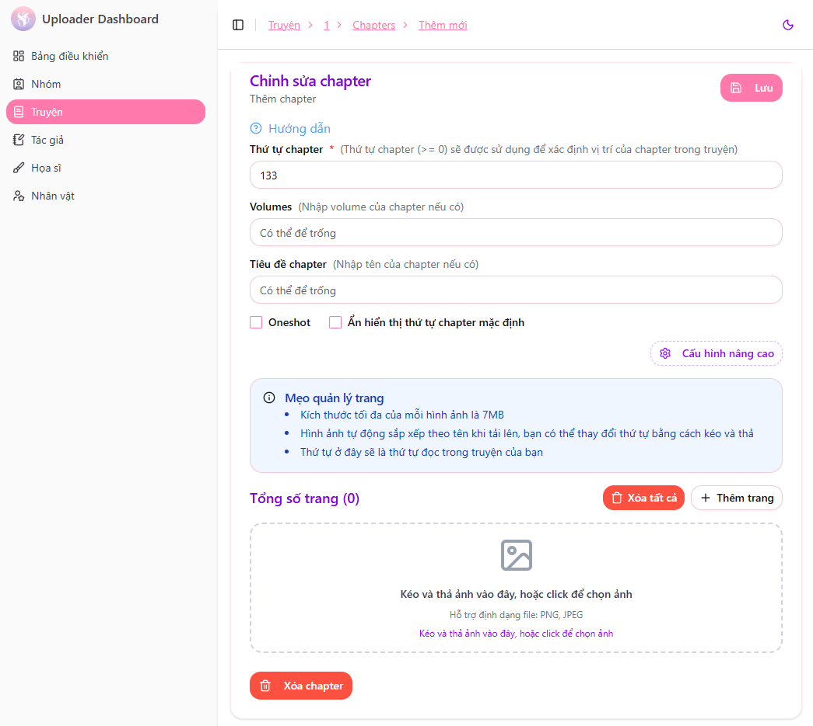
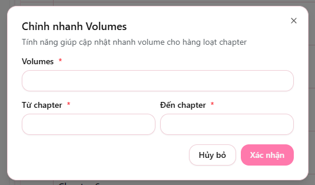

# Upload & Quản lý Chapters

Để quản lý các chapter của một bộ truyện, truy cập **Dashboard** truyện và chọn mục **Chapters**.  
Tại đây, hệ thống sẽ hiển thị toàn bộ chapter mà nhóm đã đăng cho bộ truyện đó.

> ***Lưu ý: Trước khi bạn thêm chapter bạn nên đọc qua [Lưu ý khi đặt tên chapter](/docs/upload/chapter_name) để có thể đặt tên phù hợp***

---

## Thêm hoặc chỉnh sửa Chapter

Tại giao diện quản lý chapter:

- Nhấn **Thêm Chapter** để đăng chapter mới
- Nhấn vào một chapter đã có để chỉnh sửa

Sau đó điền đầy đủ thông tin chapter và tiến hành upload hình ảnh chương truyện.

---

### Thông tin cần nhập

| Thông tin | Mô tả |
|---|---|
| **Thứ tự Chapter** *(>= 0)* | Số thứ tự chapter, dùng để sắp xếp và tạo tên mặc định |
| **Volume** *(tùy chọn)* | Chọn Volume mà chapter thuộc về (nếu truyện có chia volume) |
| **Tên Chapter** *(tùy chọn)* | Tên riêng của chapter (nếu không nhập sẽ dùng tên mặc định) |
| **Oneshot** *(tùy chọn)* | Đánh dấu chapter là Oneshot |
| **Ẩn tên chapter mặc định** *(tùy chọn)* | Ẩn tên chapter được hệ thống tự sinh |
| **Cấu hình nâng cao** | Ẩn chapter, lên lịch phát hành, tùy chỉnh hiển thị credit & donate |

> 💡 Lưu ý:  
> - Thứ tự chapter bắt đầu từ 0 trở lên  
> - Tên chapter và volume không bắt buộc, hệ thống sẽ tự đặt tên nếu bạn để trống  
> - Chế độ nâng cao hữu ích khi muốn lên lịch hoặc để chapter private trước khi public  

---

### Hoàn tất đăng tải

Sau khi nhập đầy đủ thông tin, nhấn **Lưu** để:

- Tải chapter mới lên hệ thống, hoặc
- Cập nhật chapter đã có

Hệ thống sẽ xử lý và hiển thị chapter trên web đọc khi chapter được public.

## Chỉnh nhanh Volume

Tính năng **Chỉnh nhanh Volumes** cho phép cập nhật volume cho nhiều chapter cùng lúc, giúp tiết kiệm thời gian thay vì chỉnh từng chapter riêng lẻ.

Nhấn vào nút **"Chỉnh nhanh Volumes"**, sau đó nhập thông tin cần cập nhật:

- **Volume** — Tên Volume cần gán
- **Từ chapter** — Chapter bắt đầu áp dụng Volume
- **Đến chapter** — Chapter kết thúc áp dụng Volume

Sau khi nhập thông tin, xác nhận để hệ thống tự động cập nhật volume cho các chapter được chọn.

> 📌 Lưu ý: Hãy đảm bảo chọn đúng phạm vi chapter để tránh cập nhật nhầm.

---

🎉 **Chúc mừng!** Bạn đã đăng chapter thành công.  
Nếu gặp lỗi khi upload hình ảnh hoặc sắp xếp thứ tự, vui lòng liên hệ admin để được hỗ trợ nhanh nhất.
