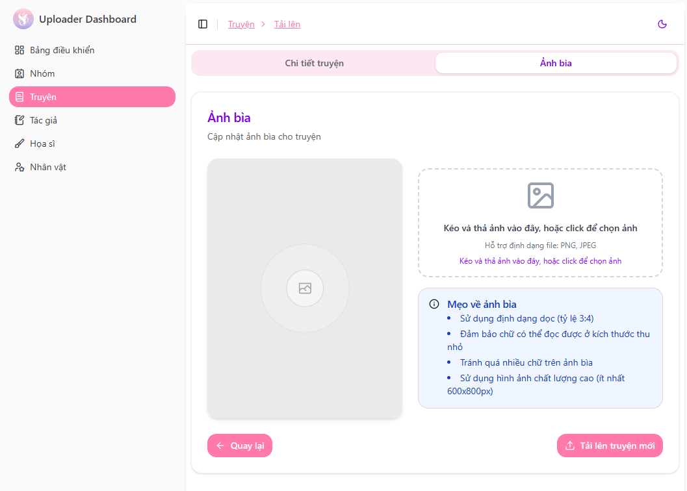

# Hướng dẫn đăng truyện

Sau khi được cấp quyền Upload, nhóm dịch có thể truy cập trang dành riêng cho việc đăng truyện và quản lý chương.

👉 Link upload: **https://upload.yurigarden.com**

---

## Bắt đầu đăng truyện

Tại trang Upload, bạn có thể chọn một trong hai cách sau:

### ✅ Truyện đã có trên web
Nếu bộ truyện bạn muốn đăng **đã tồn tại trên Yuri Garden**, vui lòng:

1. Tìm bộ truyện trong **Bảng điều khiển**
2. Nhấn chọn truyện và lấy quyền upload
3. Tiến hành nhận quyền đăng chapter cho nhóm mình

### ✅ Truyện chưa có trên web
Nếu bộ truyện **chưa có trên web**, bạn cần tạo truyện mới:

1. Vào **Bảng điều khiển**
2. Chọn **Tạo truyện**
3. Hệ thống sẽ chuyển đến trang nhập thông tin truyện

---

## Nhập thông tin truyện

Tại giao diện tạo truyện, vui lòng điền đầy đủ các mục sau:

- Tiêu đề
- Tên khác (nếu có)
- Mô tả truyện
- Trạng thái (đang tiến hành / hoàn thành / gián đoạn)
- Tác giả & Họa sĩ
- Thể loại
- Cặp đôi (Couple)

> 💡 **Lưu ý quan trọng**
> - Truyện **phải có tag “doujinshi”** thì mới có thể thêm Couple
> - Kiểm tra tên tác giả/họa sĩ trong danh sách trước khi tạo mới để tránh trùng lặp
> - Nếu truyện có nội dung 18+, hãy bật tùy chọn **Nội dung người lớn (18+)**
>     - Truyện 18+ sẽ hiển thị tại khu vực dành riêng
>     - Truyện chỉ có yếu tố NSFW nhẹ: **không cần bật**

---

## Ảnh bìa truyện

Tiếp theo, tải ảnh bìa cho truyện:

### 📌 Yêu cầu ảnh bìa

- Tỷ lệ hiển thị: **3:4**
- Dung lượng tối đa: **7MB**
- Khuyến khích ảnh rõ nét, chất lượng tốt

---

## Hoàn tất

Sau khi hoàn tất tất cả thông tin và ảnh bìa, nhấn **`Tải lên truyện`** để hoàn tất quá trình.

🎉 Chúc mừng! Bộ truyện của bạn sẽ được hiển thị trên Yuri Garden sau khi upload thành công.  
Nếu phát hiện sai sót, bạn có thể quay lại chỉnh sửa hoặc liên hệ Admin để được hỗ trợ.
